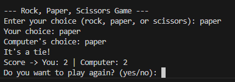

# Rock, Paper, Scissors Game

This project is a command-line implementation of the classic Rock, Paper, Scissors game. Play against the computer and see who can score the most points!

## Project Screenshot


## Features

- **Interactive Gameplay**: Play multiple rounds of Rock, Paper, Scissors against the computer.
- **Score Tracking**: Keep track of your score and the computer's score throughout the game.
- **Random Computer Choices**: The computer randomly selects its choice each round.
- **Error Handling**: Handles invalid inputs and unexpected errors gracefully.

## Requirements

- Python 3.x

## Installation

1. Clone the repository:
   ```bash
   git clone https://github.com/sifat-8208/RockPaper.git
   ```
2. Navigate to the project directory:
   ```bash
   cd RockPaper
   ```

## Usage

1. Run the game script:
   ```bash
   python game.py
   ```
2. Follow the on-screen instructions to play the game.
3. Enter your choice (rock, paper, or scissors) when prompted.
4. Decide whether to play another round or exit the game.

## License

This project is licensed under the [MIT License](https://opensource.org/licenses/MIT). You are free to use, modify, and distribute this project.

## Disclaimer

This game is intended for educational and entertainment purposes. Enjoy playing Rock, Paper, Scissors and feel free to contribute or modify the code as you wish!